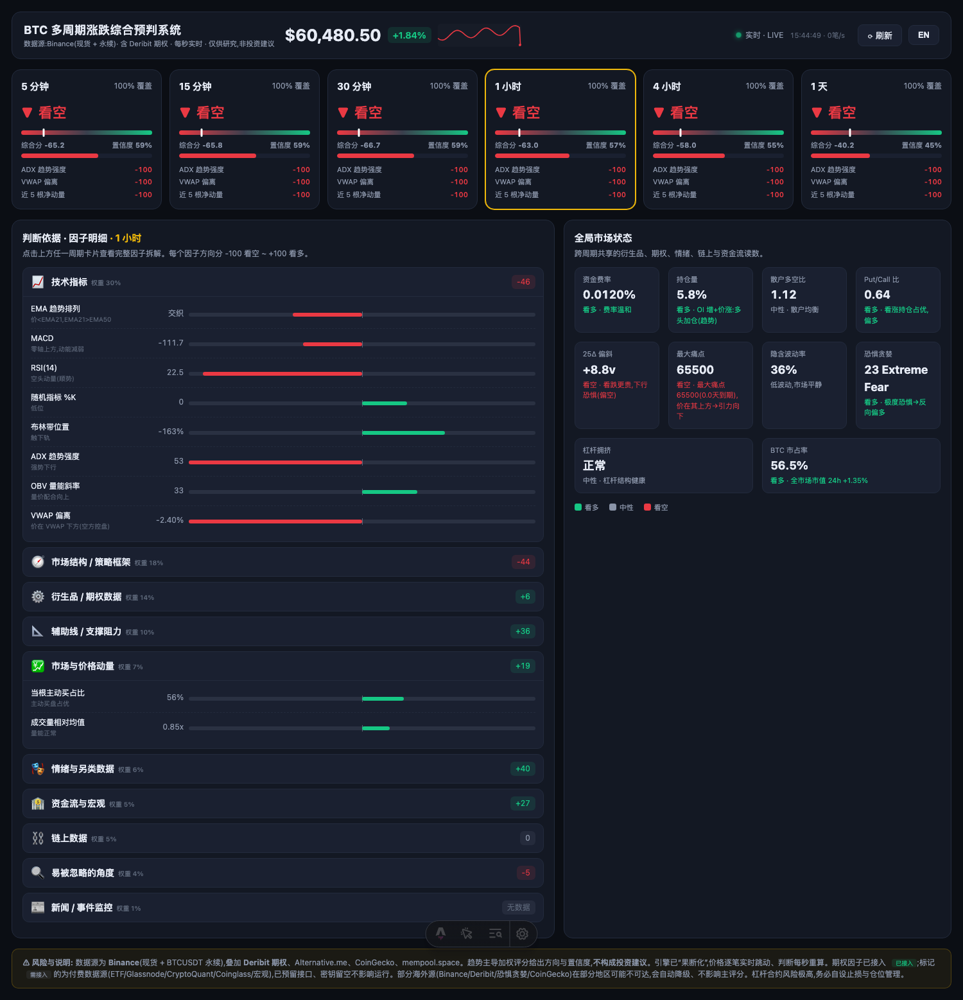
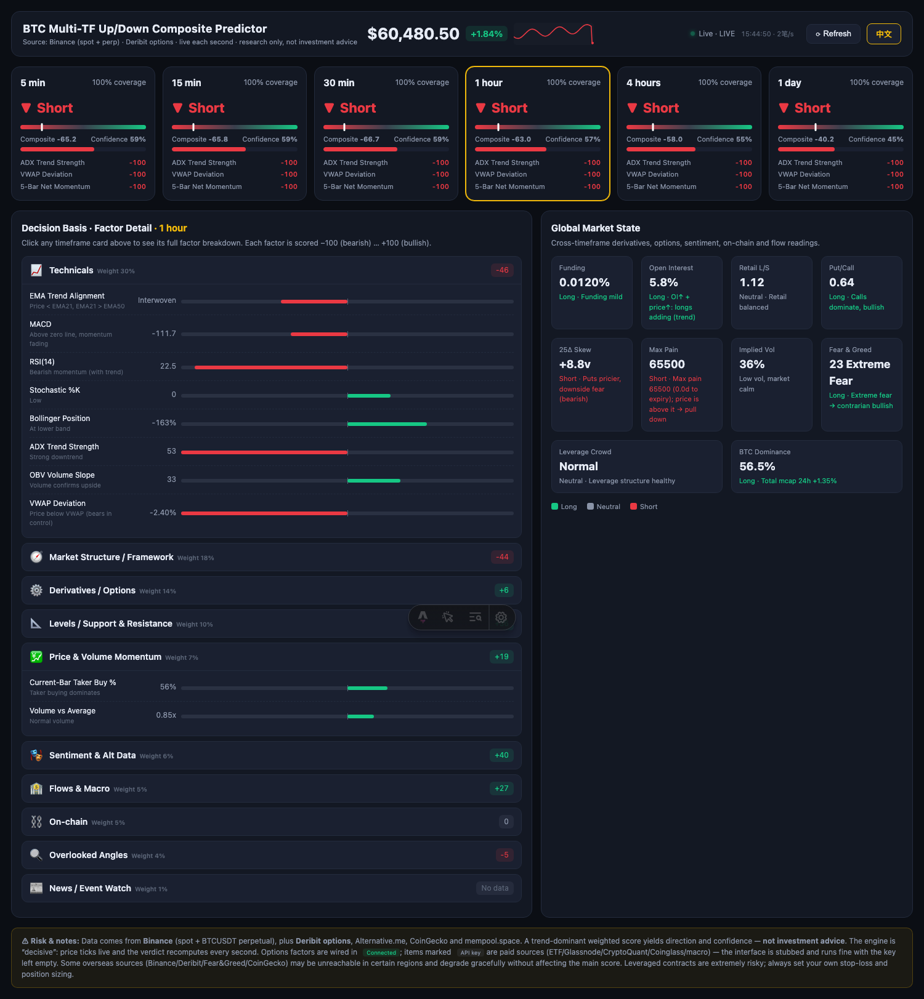

# BTC Multi-Timeframe Up/Down Composite Predictor

A real-time Bitcoin **multi-timeframe up/down composite prediction** dashboard,
rebuilt with [Astro](https://astro.build) + [pnpm](https://pnpm.io). It computes
a trend-dominant weighted score across **27 factors / 10 categories** for six
timeframes (5m · 15m · 30m · 1h · 4h · 1d), with a live price feed, sparkline,
factor breakdown, and a global market-state gauge.

> ⚠️ **Research only — not investment advice.** Leveraged contracts are
> extremely risky; always set your own stop-loss and position sizing.

| 中文                                          | English                                     |
|---------------------------------------------|---------------------------------------------|
|  |  |

## Credits

This is a faithful rebuild of the original single-file HTML dashboard by
**[ZAIJIN88](https://github.com/ZAIJIN88/-)** — <https://github.com/ZAIJIN88/->.
All of the scoring methodology, factor design, category weights, and the visual
design originate from that project. This repository ports it to a modern Astro
toolchain, swaps the data source, and adds bilingual support.

## What changed vs. the original

- **Astro + pnpm + TypeScript.** The single 460-line HTML file is decomposed
  into typed modules (`engine`, `indicators`, `binance`, `render`, `i18n`) and
  bundled by Vite. The indicator math and the composite-scoring algorithm are
  ported **1:1** — numeric output is identical.
- **OKX → Binance data sources.** Every OKX endpoint is replaced with its
  Binance equivalent (the public, **keyless** endpoints in
  [Data sources](#data-sources-all-public-no-api-key) below). No data is dropped:

  | Feed             | OKX (original)                       | Binance (this build)                        |
  |------------------|--------------------------------------|---------------------------------------------|
  | Candles          | `/api/v5/market/candles`             | `/api/v3/klines`                            |
  | 24h ticker       | `/api/v5/market/ticker`              | `/api/v3/ticker/24hr`                       |
  | Funding          | `/api/v5/public/funding-rate`        | `/fapi/v1/premiumIndex`                     |
  | Open interest    | `rubik/.../open-interest-volume`     | `/futures/data/openInterestHist`            |
  | Long/short ratio | `rubik/.../long-short-account-ratio` | `/futures/data/globalLongShortAccountRatio` |
  | Taker buy/sell   | `rubik/.../taker-volume`             | derived from klines `takerBuyBase`          |
  | Order book       | `/api/v5/market/books`               | `/api/v3/depth`                             |
  | Live stream      | OKX WebSocket                        | Binance combined WS (`@trade` + `@ticker`)  |

  Deribit options, Alternative.me Fear & Greed, CoinGecko dominance and
  mempool.space (fees + hashrate) are unchanged — they were already keyless.
- **Bilingual CN / EN toggle.** Every string — including the dynamically
  generated factor notes — is routed through an i18n layer. Click **EN / 中文**
  in the header; the choice persists in `localStorage`.
- **API-key (paid) factors are built but inert.** ETF flows, DXY/yields,
  Glassnode/CryptoQuant on-chain (MVRV/SOPR/netflow), and Coinglass liquidation
  maps are scaffolded in [`src/lib/paid-sources.ts`](src/lib/paid-sources.ts)
  with an empty-by-default key config. With keys blank they render as
  **“needs API key”** stubs and never break the app — see [`.env.example`](.env.example).

### Two improvements that fell out of the migration

Switching to Binance didn't just preserve the original — it fixed two factors
that were effectively dead in the OKX build:

1. **Real per-bar taker direction.** Binance klines expose `takerBuyBase`
   (kline column 9), so the **current-bar taker buy %** factor (`takervol`) and
   the **market taker buy/sell ratio** (`takerg`) now use genuine taker-side
   volume. OKX candle data carries no per-bar taker direction, so the original
   synthesized it as `volume / 2` — i.e. a constant ~50%, contributing no real
   signal. (`src/lib/binance.ts` → `binanceCandles`/`normGlobals`,
   `src/lib/engine.ts` → `priceFactors`.)
2. **Deribit options factors actually compute.** The original passed Deribit's
   raw `{ result: [...] }` envelope straight into `computeOptions`, whose first
   guard (`!arr.length`) silently returned `null` — disabling **Put/Call ratio
   (`pcr`)**, **25Δ skew (`skew`)**, **max pain (`maxpain`)** and **ATM implied
   volatility (`ivol`)** on every cycle, even though the UI advertised them as
   “已接入 / connected”. This build extracts `.result` (`deribitArray` in
   `src/lib/binance.ts`), so all four options factors compute as intended.

## Data sources (all public, no API key)

These are the public market-data endpoints that feed the **live** composite (the
~27-factor signal originally computed upstream by `engine.compute_tf_detail`,
assembled in `live_data.py` and consumed by `btcls_paper.py` /
`btcls_polymarket.py` — which this dashboard mirrors in the browser). All require
**no API key / auth**, and every fetch is **fail-soft**: a down source returns
`None`/`{ok:false}` and its factor simply drops from the composite's weighted sum
(`available=false`) rather than failing the cycle.

| #  | Method & URL                                                             | Params                                         | Feeds (factor → category)                                                                                                                                                                                          | Reference fn (`live_data.py`)             |
|----|--------------------------------------------------------------------------|------------------------------------------------|--------------------------------------------------------------------------------------------------------------------------------------------------------------------------------------------------------------------|-------------------------------------------|
| 1  | `GET https://api.binance.com/api/v3/klines`                              | `symbol=BTCUSDT`, `interval` (per TF), `limit` | **Core price predictor** — `ema`,`macd`,`rsi`,`stoch`,`boll`,`adx`,`obv`,`vwap` (technicals); `sr`,`fib` (levels); `ms`,`mom` (structure); `takervol`,`volexp` (price); `takerg` (derivatives, via `takerBuyBase`) | `fetch_binance_klines` / `compute_takerg` |
| 2  | `GET https://fapi.binance.com/fapi/v1/premiumIndex`                      | `symbol=BTCUSDT`                               | `funding` (derivatives) + `crowd` (overlooked)                                                                                                                                                                     | `fetch_binance_funding`                   |
| 3  | `GET https://api.binance.com/api/v3/ticker/24hr`                         | `symbol=BTCUSDT`                               | 24h price change — paired with OI for the `oi` 4-quadrant rule                                                                                                                                                     | `fetch_binance_price_change_pct`          |
| 4  | `GET https://fapi.binance.com/futures/data/openInterestHist`             | `symbol=BTCUSDT`, `period=5m`, `limit=30`      | `oi` (derivatives)                                                                                                                                                                                                 | `fetch_binance_oi_change`                 |
| 5  | `GET https://fapi.binance.com/futures/data/globalLongShortAccountRatio`  | `symbol=BTCUSDT`, `period=5m`, `limit=1`       | `lsacct` (derivatives)                                                                                                                                                                                             | `fetch_binance_ls`                        |
| 6  | `GET https://api.binance.com/api/v3/depth`                               | `symbol=BTCUSDT`, `limit=50`                   | `obi` — order-book imbalance (overlooked)                                                                                                                                                                          | `fetch_binance_book_imbalance`            |
| 7  | `GET https://www.deribit.com/api/v2/public/get_book_summary_by_currency` | `currency=BTC`, `kind=option`                  | `pcr`, `skew`, `maxpain` (derivatives/overlooked); `ivol` (info-only, excluded)                                                                                                                                    | `fetch_deribit_options`                   |
| 8  | `GET https://api.alternative.me/fng/?limit=2`                            | —                                              | `fng` — Fear & Greed (sentiment)                                                                                                                                                                                   | `fetch_fng`                               |
| 9  | `GET https://api.coingecko.com/api/v3/global`                            | —                                              | `dom` — BTC dominance change (flows)                                                                                                                                                                               | `fetch_dominance_change`                  |
| 10 | `GET https://mempool.space/api/v1/fees/recommended`                      | —                                              | `mempool` (onchain, info-only — score 0)                                                                                                                                                                           | `fetch_mempool_fee`                       |
| 11 | `GET https://mempool.space/api/v1/mining/hashrate/1m`                    | —                                              | `hash` (onchain, info-only — score 0)                                                                                                                                                                              | `fetch_hashrate`                          |

### Notes

- **No API key**: all endpoints are public read-only market data. A key would
  only be needed for real trading (account/order endpoints), which this project
  never calls. Premium factors that *do* need a key (ETF / Glassnode /
  CryptoQuant / Coinglass / macro) are stubbed — see
  [API-key (paid) factors](#what-changed-vs-the-original) above.
- **Klines drive the bulk of the signal**; the rest are the snapshot/derivative
  factors that a price-only backtest can't test (and that the live recorder
  accrues forward).
- **Geo note**: `api.binance.com` / `fapi.binance.com` are blocked in some
  regions (e.g. the US). From a blocked IP those calls fail and the composite
  degrades (factors drop) — it does not crash. Likewise Deribit / Fear & Greed /
  CoinGecko may be unreachable in some regions and degrade gracefully.
- **Polling**: the dashboard polls a handful of calls per cycle (1s price ticker,
  12s kline refresh, 20s globals), well within Binance's IP rate limits, plus a
  live `@trade` / `@ticker` WebSocket.

### Not prediction inputs (for reference)

These belong to the upstream Python project and are **not** part of the
dashboard's signal — listed only for provenance:

- `POST https://api.hyperliquid.xyz/info` `{"type":"allMids"}` → the Hyperliquid
  execution/PnL price in the paper trader, not a signal input.
- `GET https://gamma-api.polymarket.com/markets?slug=btc-updown-5m-<round_start>`
  → the Polymarket round's Up/Down odds for PnL, not a BTC-price predictor.
- The **backtest** (`data.py`, `btcls_backtest.py`) instead predicts from
  Hyperliquid only: `POST https://api.hyperliquid.xyz/info` with
  `{"type":"candleSnapshot"}` (klines) and `{"type":"fundingHistory"}`
  (funding/crowd).

## Getting started

```bash
pnpm install
pnpm dev          # http://localhost:4321
```

| Command         | Description                                       |
|-----------------|---------------------------------------------------|
| `pnpm dev`      | Start the dev server                              |
| `pnpm build`    | Build the static site to `dist/`                  |
| `pnpm preview`  | Preview the production build                      |
| `pnpm check`    | `astro check` — TypeScript / template diagnostics |
| `pnpm test:e2e` | Run the Playwright E2E suite                      |

## End-to-end verification

The Playwright suite ([`tests/e2e`](tests/e2e)) mocks every network call with
deterministic fixtures, so it verifies the OKX→Binance migration and the engine
**offline and reproducibly**. It covers:

- six timeframe cards render with direction, score and confidence;
- live price + 24h change from the Binance ticker;
- all 10 factor categories with factor rows;
- Deribit options factors are wired in;
- the global market-state gauge;
- API-key (paid) factors render as stubs **without breaking** the app;
- no uncaught page errors during a live cycle;
- the CN→EN toggle translates the entire UI with **zero Chinese leaks**, and the
  choice persists across reload.

```bash
pnpm exec playwright install chromium   # first run only
pnpm test:e2e
```

## Project structure

```
src/
  pages/index.astro      # page shell + chrome (data-i18n hooks)
  scripts/app.ts         # realtime engine + bootstrap + language toggle
  lib/
    binance.ts           # Binance data layer (the OKX→Binance migration)
    engine.ts            # factor builders + composite scoring (1:1 port)
    indicators.ts        # pure TA math (EMA/MACD/RSI/ADX/…)
    render.ts            # DOM rendering
    i18n.ts              # CN/EN dictionary + t()
    config.ts            # endpoints + (empty) API-key config
    paid-sources.ts      # scaffolding for premium/keyed factors
    constants.ts         # timeframes, category weights, icons
    types.ts             # shared types
  styles/dashboard.css   # original styles, verbatim
tests/e2e/               # Playwright suite + fixtures
```
